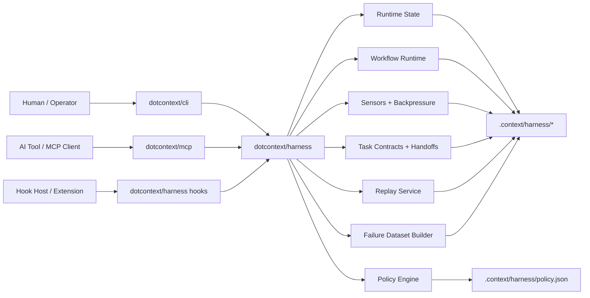
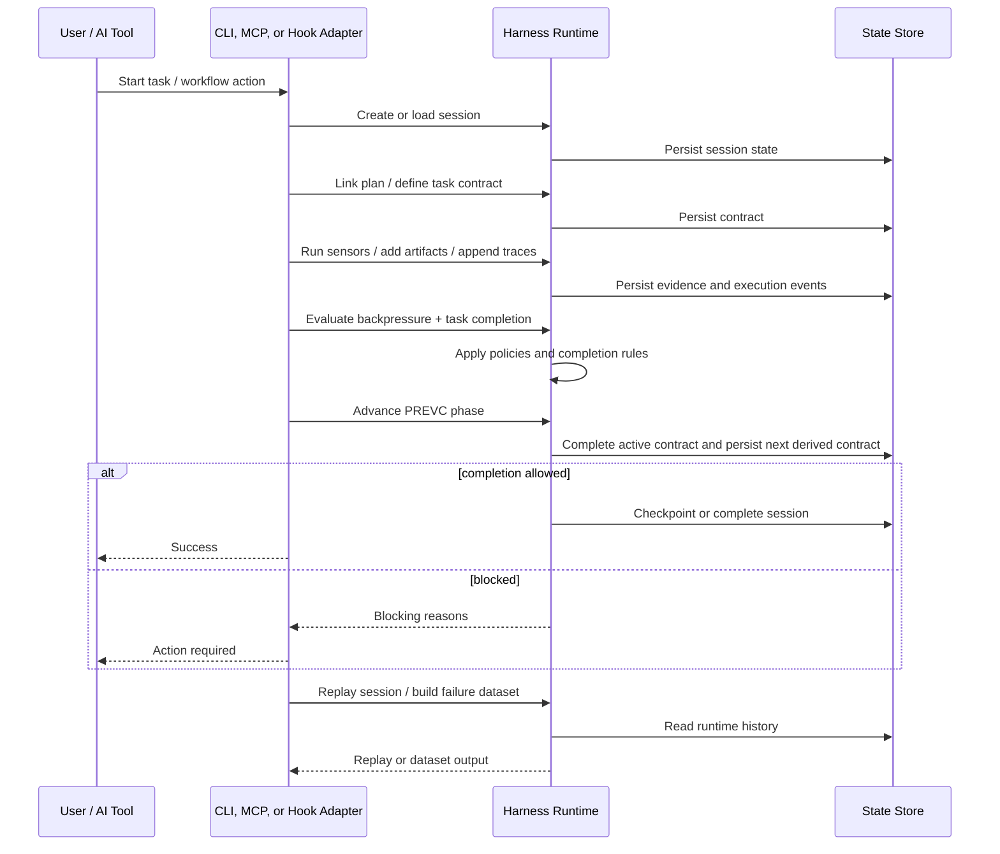
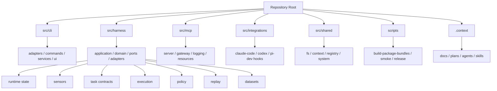
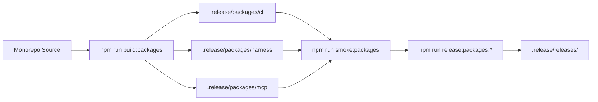

# Dotcontext Harness Architecture

This document explains how dotcontext works as a harness engineering runtime, how the current architecture is consolidated, and how the repository is organized after the `cli -> harness <- mcp` split.

## Core Model

Dotcontext now treats harness engineering as a first-class runtime concern.

- `cli` is the operator-facing interface
- `harness` is the reusable runtime and domain layer
- `mcp` is the transport adapter that exposes the harness to AI tools



## Consolidated Boundaries

The current architecture is intentionally asymmetric:

```text
cli -> harness <- mcp
```

That means:

- `harness` does not depend on `cli`
- `harness` does not depend on `mcp`
- `cli` and `mcp` are adapters over the same runtime
- transport concerns stay outside the core domain

This keeps the harness reusable for future adapters such as HTTP, workers, or SDKs.

## Harness Action Port

The reusable harness runtime now exposes transport-neutral action ports:

- `HarnessAdapterRuntime` is the adapter-facing facade for MCP-equivalent tools
- `HarnessHookAdapter` is the generic hook-facing adapter for Claude Code hooks, Codex hooks, pi.dev extensions, or other hook hosts
- `HarnessActionService` lives in `src/harness/application/actions`
- `HarnessAgentActionService` lives in `src/harness/application/agents`
- `HarnessSkillActionService` lives in `src/harness/application/skills`
- `HarnessPlanActionService` lives in `src/harness/application/workflow` or `src/harness/application/actions`
- `HarnessExploreActionService` lives in `src/harness/application/context`
- `HarnessContextActionService` lives in `src/harness/application/context`
- `HarnessSyncActionService` lives in `src/harness/application/exchange`
- `HarnessWorkflowManageActionService` lives in `src/harness/application/workflow`
- `HarnessWorkflowActionService` lives in `src/harness/application/workflow`
- `HarnessActionInput`, `HarnessAgentActionInput`, `HarnessSkillActionInput`, `HarnessPlanActionInput`, `HarnessExploreActionInput`, `HarnessContextActionInput`, `HarnessSyncActionInput`, `HarnessWorkflowManageActionInput`, workflow init/status/advance inputs, and their result types describe adapter-neutral runtime actions
- MCP delegates `harness`, `agent`, `skill`, `plan`, `explore`, `context`, `sync`, `workflow-init`, `workflow-status`, `workflow-advance`, and `workflow-manage` calls to these services and only wraps the result in an MCP response envelope

Future adapters such as Claude Code hooks, Codex hooks, HTTP endpoints, or editor extensions should consume these action services instead of copying MCP gateway logic. Protocol adapters are responsible only for validation, authentication, and protocol-specific response envelopes.

Adapters that want parity with the MCP tool set should prefer `HarnessAdapterRuntime.execute({ tool, params })`. It accepts MCP-equivalent tool names such as `context`, `workflow-advance`, or `harness`, and returns an adapter-neutral result kind (`json`, `text`, or `scaffold`) for the adapter to serialize into its own protocol.

Hook-based integrations should use `HarnessHookAdapter.handle(event)`. The event envelope is intentionally small: `{ tool, params, requestId?, source?, metadata? }`. The hook adapter validates the envelope, calls `HarnessAdapterRuntime`, and returns a hook response with `ok`, `source`, `tool`, `requestId`, and either `result` or `error`. Generic source factories such as `createClaudeCodeHarnessHookAdapter`, `createCodexHarnessHookAdapter`, and `createPiDevHarnessHookAdapter` live in the harness layer; host extension factories such as `createClaudeCodeHookAdapter`, `createCodexHookAdapter`, and `createPiDevHookAdapter` live in `src/integrations`. They label the host source without duplicating MCP gateway logic or assuming a vendor-specific protocol shape.

## Runtime Responsibilities

### 1. Runtime State

The harness persists durable execution state under `.context/harness`.

- sessions
- traces
- artifacts
- checkpoints
- contracts
- replays
- datasets
- policy documents

### 2. Guides

The current guide layer is implemented primarily through:

- workflow structure
- task contracts
- handoff contracts
- policy rules

These mechanisms constrain what the agent can do and what evidence it must produce.

### 3. Sensors

Sensors are the feedback layer.

- they run checks
- persist evidence
- produce blocking or non-blocking findings
- feed backpressure into task and workflow completion

### 4. Replay and Dataset

Replay and dataset generation turn runtime history into inspectable artifacts.

- session replay reconstructs the execution timeline
- failure datasets cluster repeated breakdowns
- this is the basis for future evaluation and learning loops

## Execution Lifecycle

The harness lifecycle is now explicit and durable.



When a linked plan includes structured `phases[].steps[].deliverables`, the workflow layer derives the active task contract from that metadata. `plan link` bootstraps the current phase contract, and `workflow-advance` rotates it while the harness remains responsible for persistence and completion checks.

## Current Repository Shape



The canonical source paths are `src/cli`, `src/harness`, `src/mcp`, `src/integrations`, and `src/shared`. `src/services` is not a target architecture folder. During migration, old deep imports should be redirected through package exports, local path aliases, or short-lived release-branch shims, but the source tree should not keep `src/services` as a permanent compatibility layer.

## Packaging Model

The codebase is still developed in one repository, but the runtime is now organized to package cleanly into three surfaces.



## Why This Matches Harness Engineering

This architecture aligns with harness engineering in four practical ways:

1. The model is no longer the center of the system; the runtime is.
2. The core controls are explicit: guides, sensors, policies, contracts, and backpressure.
3. Execution is durable and inspectable through traces, replays, and datasets.
4. Transport is separated from control logic, so the harness can evolve without rewriting the CLI or MCP surface.

## Current Status

The current consolidated architecture already supports:

- durable harness sessions
- workflow-bound execution
- policy-controlled mutations
- evidence-driven completion checks
- replayable execution history
- clustered failure datasets
- local packaging and smoke validation for `cli`, `harness`, and `mcp`

The next layer of evolution is not more boundary work. It is product depth on top of this runtime:

- stronger default policies
- richer evaluator flows
- replay-driven benchmarking
- multi-agent templates
- publishable package distribution
