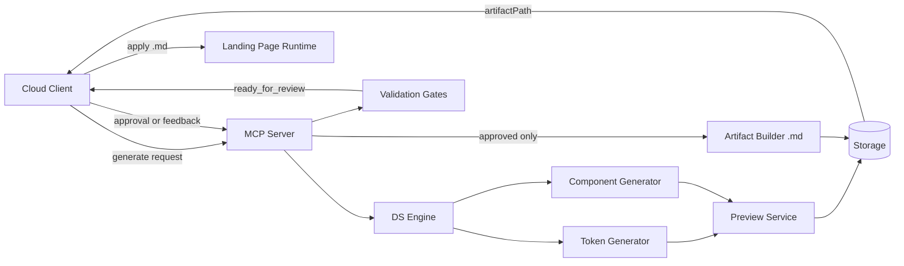
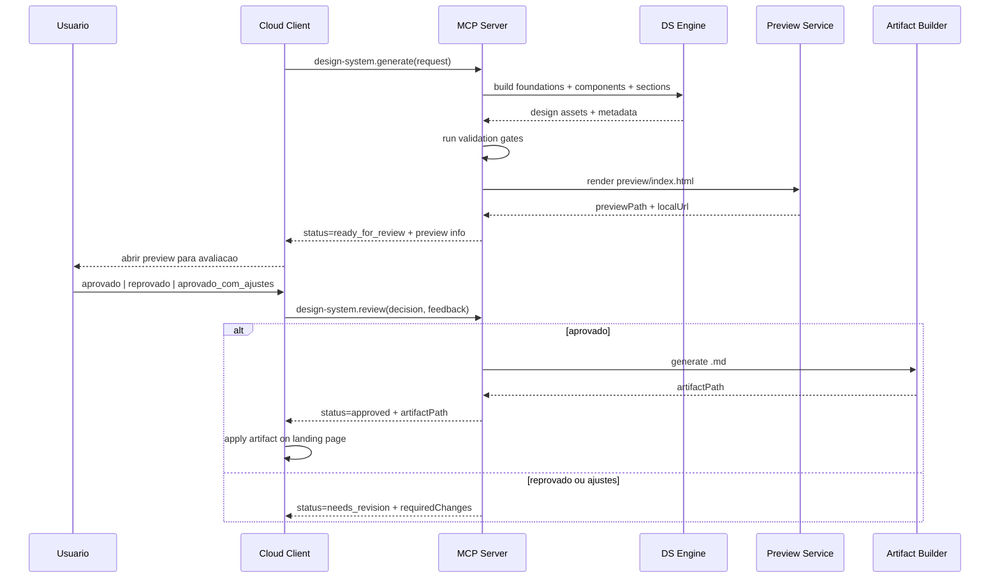
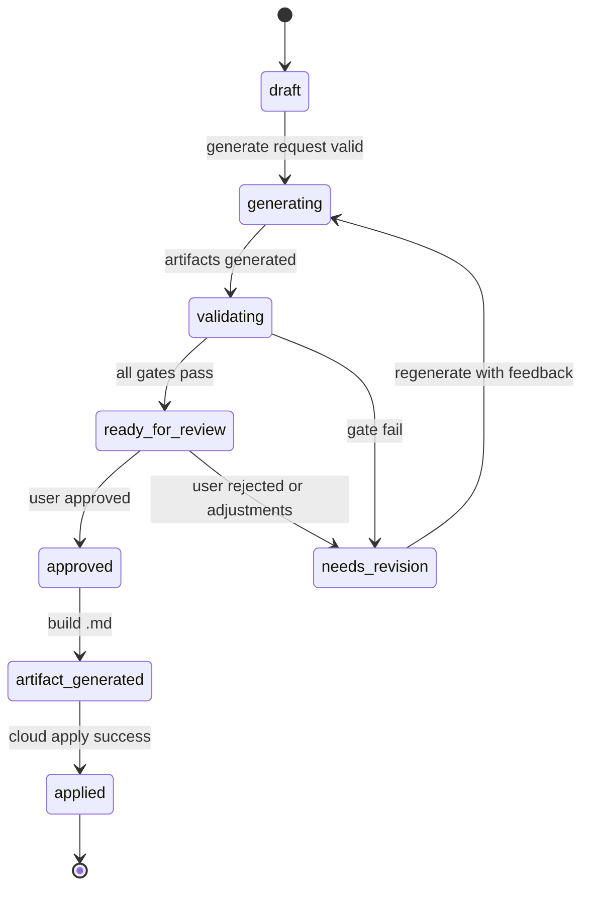

# Orquestracao Design Systems

## Objetivo
Criar um fluxo padrao em que o **Cloud Client** chama o **MCP Server**, o MCP gera um **Design System completo com preview HTML**, coleta aprovacao do usuario e, somente apos aprovacao, gera um artefato final `.md` para aplicacao automatica na landing page.

## Meta de Execucao Confiavel
- Sem ambiguidade de entrada e saida.
- Pipeline deterministico com gates obrigatorios.
- Sem aplicacao automatica sem aprovacao explicita.
- Falha segura: se validacao falhar, retorna `needs_revision` e bloqueia o artefato final `.md`.

---

## 1) Arquitetura (alto nivel)

### Componentes
1. `Cloud Client`
- Coleta PRD/plano e preferencias visuais.
- Inicia requisicao ao MCP.
- Mostra preview para aprovacao.
- Dispara aplicacao quando o artefato `.md` estiver aprovado.

2. `MCP Server`
- Recebe requisicao e orquestra o pipeline.
- Gera tokens, componentes e preview.
- Executa validacoes tecnicas.
- Controla estados (`draft`, `ready_for_review`, `approved`, `needs_revision`).

3. `DS Engine` (dentro do MCP)
- Gera foundations (cores, tipografia, spacing, radius, elevation, breakpoints).
- Gera componentes (Button, Input, Card, Navbar, Footer).
- Gera templates de secao (Hero, Features, Testimonials, FAQ, CTA).

4. `Preview Service` (dentro do MCP)
- Gera `preview/index.html` com board de aprovacao.
- Exibe checklist de aprovacao.

5. `Artifact Builder` (dentro do MCP)
- Gera artefato `.md` final somente com status `approved`.

6. `Storage`
- Guarda versoes do DS, manifests e historico de feedback.

### Diagrama de Arquitetura


---

## 2) Sequencia de Execucao (Cloud -> MCP -> Usuario -> Apply)



---

## 3) Maquina de Estados



---

## 4) Estrutura de Arquivos Gerados

```text
/design-system
  /preview
    index.html
  /tokens
    colors.json
    typography.json
    spacing.json
    radius.json
    elevation.json
    breakpoints.json
  /components
    button.json
    input.json
    card.json
    navbar.json
    footer.json
  /sections
    hero.json
    features.json
    testimonials.json
    faq.json
    cta.json
  /manifests
    ds-manifest.json
    validation-report.json
    approval-log.json
  /artifacts
    design-system.md
```

---

## 5) Contratos de Entrada e Saida (JSON)

### 5.1 Requisicao de Geracao
```json
{
  "action": "design-system.generate",
  "requestId": "uuid",
  "project": {
    "id": "project-123",
    "name": "Landing X",
    "audience": "SaaS B2B",
    "goal": "captar_leads",
    "tone": ["moderno", "confiavel", "objetivo"]
  },
  "designInput": {
    "paletteMode": "provided_or_generate",
    "providedPalette": {
      "primary": "#2563EB",
      "secondary": "#0EA5E9",
      "accent": "#22C55E"
    },
    "typographyMode": "provided_or_suggest",
    "providedTypography": {
      "display": "Poppins",
      "body": "Inter"
    },
    "references": [
      "https://example.com/reference-1"
    ]
  },
  "constraints": {
    "mobileFirst": true,
    "accessibility": "WCAG_AA",
    "componentsMin": 5,
    "sectionsMin": 5
  },
  "version": "v0.1.0"
}
```

### 5.2 Resposta da Geracao
```json
{
  "requestId": "uuid",
  "status": "ready_for_review",
  "designSystemId": "ds-2026-03-04-001",
  "version": "v0.1.0",
  "preview": {
    "filePath": "/design-system/preview/index.html",
    "localUrl": "http://localhost:4173/design-system/preview/index.html"
  },
  "artifacts": {
    "tokensPath": "/design-system/tokens",
    "componentsPath": "/design-system/components",
    "validationReportPath": "/design-system/manifests/validation-report.json"
  },
  "gates": {
    "allPassed": true,
    "failedRules": []
  }
}
```

### 5.3 Requisicao de Review
```json
{
  "action": "design-system.review",
  "designSystemId": "ds-2026-03-04-001",
  "decision": "approved_with_adjustments",
  "feedback": {
    "colorsApproved": true,
    "typographyApproved": false,
    "componentsApproved": true,
    "sectionsApproved": true,
    "notes": [
      "Ajustar escala de H2 e H3",
      "Aumentar contraste do texto secundario"
    ]
  }
}
```

### 5.4 Resposta de Review
```json
{
  "designSystemId": "ds-2026-03-04-001",
  "status": "needs_revision",
  "requiredChanges": [
    "typography.scale",
    "semantic.text.secondary.contrast"
  ],
  "nextAction": "design-system.generate_revision"
}
```

### 5.5 Resposta Final (Aprovado)
```json
{
  "designSystemId": "ds-2026-03-04-001",
  "status": "approved",
  "artifact": {
    "type": "md",
    "filePath": "/design-system/artifacts/design-system.md",
    "checksum": "sha256:..."
  }
}
```

---

## 6) Gates de Validacao (bloqueantes)

### Gate A - Estrutura minima
- Deve existir: `tokens`, `components`, `sections`, `preview`.
- Deve conter no minimo 5 componentes e 5 secoes.

### Gate B - Tokens obrigatorios
- Primitive tokens: cores base, spacing base, radius base, font sizes base.
- Semantic tokens: `bg/*`, `text/*`, `border/*`, `action/*`, `feedback/*`.
- Component tokens: pelo menos para Button, Input, Card, Navbar, Footer.

### Gate C - Acessibilidade
- Contraste minimo AA para texto principal e CTAs.
- Foco visivel para elementos interativos.
- Estados `hover`, `active`, `disabled`, `focus-visible`.

### Gate D - Preview valido
- `preview/index.html` gerado com:
  - swatches + uso semantico,
  - tipografia aplicada,
  - galeria de componentes com estados,
  - landing demo (Hero, Features, CTA pelo menos).

### Gate E - Pronto para aplicacao
- O artefato `.md` so pode ser gerado quando:
  - status atual = `approved`,
  - `validation-report.json` com `allPassed=true`.

---

## 7) Plano Executavel por IA (contrato operacional)

```json
{
  "planVersion": "1.0.0",
  "workflow": [
    {
      "id": "step-01-validate-input",
      "type": "validate",
      "input": ["project", "designInput", "constraints"],
      "output": ["normalizedInput"],
      "onFail": "stop_with_error"
    },
    {
      "id": "step-02-generate-foundations",
      "type": "generate",
      "input": ["normalizedInput"],
      "output": ["tokens/colors.json", "tokens/typography.json", "tokens/spacing.json", "tokens/radius.json", "tokens/elevation.json", "tokens/breakpoints.json"]
    },
    {
      "id": "step-03-generate-components",
      "type": "generate",
      "input": ["tokens/*"],
      "output": ["components/button.json", "components/input.json", "components/card.json", "components/navbar.json", "components/footer.json"]
    },
    {
      "id": "step-04-generate-sections",
      "type": "generate",
      "input": ["components/*", "tokens/*"],
      "output": ["sections/hero.json", "sections/features.json", "sections/testimonials.json", "sections/faq.json", "sections/cta.json"]
    },
    {
      "id": "step-05-render-preview",
      "type": "render",
      "input": ["tokens/*", "components/*", "sections/*"],
      "output": ["preview/index.html"]
    },
    {
      "id": "step-06-run-gates",
      "type": "validate",
      "input": ["all_generated_files"],
      "output": ["manifests/validation-report.json"],
      "onFail": "set_status_needs_revision"
    },
    {
      "id": "step-07-await-review",
      "type": "human_approval",
      "input": ["preview/index.html", "validation-report.json"],
      "output": ["decision"]
    },
    {
      "id": "step-08-generate-md",
      "type": "generate",
      "condition": "decision == approved",
      "input": ["approved_design_system"],
      "output": ["artifacts/design-system.md"]
    }
  ],
  "statusPolicy": {
    "initial": "draft",
    "afterGenerateSuccess": "ready_for_review",
    "afterGateFail": "needs_revision",
    "afterApproval": "approved"
  }
}
```

---

## 8) Especificacao do artefato `.md` (minimo)

```json
{
  "artifactType": "design-system.md",
  "version": "v0.1.0",
  "designSystemId": "ds-2026-03-04-001",
  "tokens": {
    "colors": {},
    "typography": {},
    "spacing": {},
    "radius": {},
    "elevation": {},
    "breakpoints": {}
  },
  "componentsMap": {
    "button": {
      "variants": ["primary", "secondary", "ghost"],
      "classOrTokenRefs": []
    },
    "input": {},
    "card": {},
    "navbar": {},
    "footer": {}
  },
  "applyInstructions": [
    "inject_tokens",
    "map_components",
    "render_sections",
    "run_post_apply_checks"
  ],
  "guardrails": {
    "blockOnContrastFailure": true,
    "blockOnMissingToken": true,
    "blockOnMissingComponentMap": true
  }
}
```

---

## 9) Definicao de Pronto (DoD)

Para considerar a execucao concluida:
1. Preview HTML funcional gerado.
2. Checklist de aprovacao exibido.
3. Validacoes bloqueantes aprovadas.
4. Revisao humana registrada.
5. Artefato `.md` gerado somente apos aprovacao.
6. Tudo versionado em `ds-manifest.json`.

---

## 10) Nota de Qualidade

"100% de acerto" em producao so e viavel quando o fluxo e **fail-safe**:
- ou passa em todos os gates e executa,
- ou bloqueia com erro explicito e pede revisao.

Este plano foi desenhado exatamente para esse comportamento.
