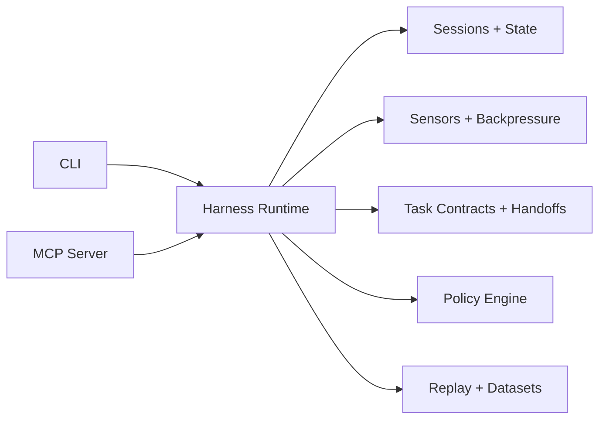

# @dotcontext/cli

[](https://www.npmjs.com/package/@dotcontext/cli)
[](https://github.com/vinilana/dotcontext/actions/workflows/ci.yml)
[](https://opensource.org/licenses/MIT)

> **Formerly `@ai-coders/context`.** Renamed to avoid confusion with Context7 and other "context" tools in the AI space. The `.context/` directory standard is unchanged. See [Migration Guide](#migration-from-ai-coderscontext).

**Dotcontext is a harness engineering runtime for AI-assisted software delivery.**

It gives coding agents a real operating environment instead of a loose prompt and a pile of conventions. Dotcontext combines shared project context, workflow structure, policies, sensors, task contracts, replayable execution history, and MCP access into one system.

The point is not just to "give the model more context". The point is to make agent execution legible, constrained, reusable, and auditable.

## What Dotcontext Is

Dotcontext is three things at once:

- a `.context/` convention for durable project knowledge
- a harness runtime that governs how agents execute work
- a CLI and MCP surface that expose that runtime to humans and AI tools

PREVC remains the default execution model for structured work: **Planning, Review, Execution, Validation, and Confirmation**.

## Why Dotcontext Exists

Most agent workflows break down for the same reasons:

- project knowledge is scattered across tool-specific formats
- execution rules live in prompts instead of in runtime controls
- agents can change code without producing evidence
- there is no durable record of why an agent did what it did
- teams cannot reuse the same operating model across Claude, Cursor, Codex, Copilot, and others

Dotcontext exists to solve that layer, not just the prompt layer.

## Architecture

Dotcontext is now organized around an explicit harness runtime:

```text
cli -> harness <- mcp
```

- `@dotcontext/cli` is the operator-facing surface
- `dotcontext/harness` is the reusable runtime and domain layer
- `dotcontext/mcp` is the MCP transport adapter

The main architecture reference, with Mermaid diagrams for runtime flow, boundaries, and packaging, lives in [ARCHITECTURE.md](./ARCHITECTURE.md).

## Problems It Solves

### 1. Context Fragmentation

Every AI coding tool now has a primary surface plus older compatibility paths that still show up in the wild. Dotcontext keeps track of both so teams can write against the current surface without losing legacy imports.

| Tool | Primary surface | Legacy / compatibility surface |
| --- | --- | --- |
| Cursor | `.cursor/rules/*.mdc`, `AGENTS.md`-scoped instructions | `.cursorrules`, `.cursor/rules/*.md` |
| Claude Code | `CLAUDE.md`, `.claude/agents`, `.claude/skills` | older memory-style files under `.claude/` |
| GitHub Copilot | `.github/copilot-instructions.md`, `.github/instructions/*.instructions.md`, `.github/agents/*.agent.md`, `.github/skills` | `.github/copilot/*` and `.github/.copilot/*` |
| Windsurf | `AGENTS.md`, `.windsurf/rules`, `.windsurf/skills` | `.windsurfrules`, older `.windsurf/` rule files |
| Gemini | `GEMINI.md`, `.gemini/commands`, `.gemini/settings.json`, `.gemini/skills` | older `.gemini/` config layouts |
| Codex | `AGENTS.md`, `.codex/skills`, `.codex/config.toml` | `.codex/instructions.md` |
| Google Antigravity | `.agents/rules`, `.agents/workflows` | older `.agent/` layouts |
| Trae AI | `.trae/rules`, `.trae/agents` | older `.trae/` rule files |

Using multiple tools means duplicating rules, playbooks, and documentation across incompatible formats.

### 2. Weak Runtime Control

Most agent setups still rely on:

- a long agent file
- a few MCP tools
- best-effort conventions

That is not enough for production-grade behavior. You need runtime controls such as policies, sensors, contracts, and backpressure.

### 3. No Durable Execution Model

Without sessions, traces, artifacts, and replay:

- agents cannot hand off work cleanly
- failures are hard to cluster and learn from
- workflow gates are hard to enforce
- evaluation becomes anecdotal instead of operational

## What Dotcontext Does

Dotcontext consolidates those concerns into one operating model.

### Shared Context

One `.context/` directory. Works everywhere.

```
.context/
├── docs/           # Your documentation (architecture, patterns, decisions)
├── agents/         # Agent playbooks (code-reviewer, feature-developer, etc.)
├── plans/          # Work plans linked to PREVC workflow
└── skills/         # On-demand expertise (commit-message, pr-review, etc.)
```

Export to any tool.
**Write once. Use anywhere. No boilerplate.**

### Harness Runtime

The runtime adds execution controls on top of the shared context:

- durable sessions, traces, artifacts, and checkpoints
- sensors and backpressure
- task contracts and handoffs
- policy enforcement
- replay and failure dataset generation

### Plan-Driven Contracts

Structured plans now carry canonical phase metadata in frontmatter, including `phases[].steps[].deliverables`.

- `plan link` bootstraps the active PREVC phase into a harness task contract when a workflow is already running
- `workflow-advance` completes the previous active contract and derives the next one from the linked plan
- the harness remains the source of truth for contract persistence and completion checks

### Multi-Surface Access

The same runtime is exposed through:

- `@dotcontext/cli` for operator workflows
- `dotcontext/mcp` for AI tools
- `dotcontext/harness` as the reusable domain/runtime boundary

## How The Harness Works

At runtime, both the CLI and the MCP server delegate to the same harness services. The harness is responsible for:

- durable sessions, traces, artifacts, and checkpoints
- sensors and backpressure
- task contracts and handoffs
- policy enforcement
- replay generation
- failure dataset clustering



For the full system view, see [ARCHITECTURE.md](./ARCHITECTURE.md).

> **Using GitHub Copilot, Cursor, Claude, or another AI tool?**
> Just run `npx @dotcontext/mcp install` — no API key needed!
>
> **Usando GitHub Copilot, Cursor, Claude ou outra ferramenta de IA?**
> Execute `npx @dotcontext/mcp install` — sem necessidade de API key!

> **Note / Nota**
> Standalone CLI generation is no longer supported. Use MCP-enabled AI tools to create, fill, or refresh context.
> A geração na CLI standalone não é mais suportada. Use ferramentas com MCP para criar, preencher ou atualizar o contexto.

## Getting Started / Como Começar

### Path 1: MCP (Recommended / Recomendado) — no API key

#### English

1. Run `npx @dotcontext/mcp install`
2. Prompt your AI agent: `init the context`
3. Then: `plan [YOUR TASK] using dotcontext`
4. After planned: `start the workflow`

**No API key needed.** Your AI tool provides the LLM.

#### Português

1. Execute `npx @dotcontext/mcp install`
2. Diga ao seu agente de IA: `init the context`
3. Depois: `plan [SUA TAREFA] using dotcontext`
4. Após o planejamento: `start the workflow`

**Sem necessidade de API key.** Sua ferramenta de IA fornece o LLM.

### Path 2: Standalone CLI — sync, imports, and admin tools

#### English

1. Run `npx -y @dotcontext/cli@latest`
2. Use the interactive CLI for sync, reverse sync, hidden admin tools, and MCP setup
3. When you need context creation or AI-generated content, use your MCP-connected AI tool

#### Português

1. Execute `npx -y @dotcontext/cli@latest`
2. Use a CLI interativa para sincronização, reverse sync, ferramentas administrativas ocultas e configuração MCP
3. Quando precisar criar contexto ou gerar conteúdo com IA, use sua ferramenta conectada via MCP

## MCP Server Setup

This package includes an MCP (Model Context Protocol) server that provides AI coding assistants with powerful tools to analyze and document your codebase.

### Recommended Installation

Use the installer. It is the source of truth for supported tools and config formats:

```bash
npx @dotcontext/mcp install
```

If you already have the MCP package installed globally, `dotcontext-mcp install` works too. The legacy `dotcontext mcp:install` CLI flow still works as a compatibility path.

The installer:
- Detects installed AI tools on your system
- Opens the interactive tool picker when you run `install` in a terminal without a tool id
- Configures the `dotcontext` MCP server in each tool
- Supports global (home directory) and local (project directory) installation
- Falls back to `all` detected tools in non-interactive runs without a tool id
- Merges with existing MCP configurations without overwriting unrelated servers
- Includes `--dry-run` and `--verbose` modes
- Writes the config shape required by each supported client

Examples:

```bash
# Interactive install for detected tools
npx @dotcontext/mcp install

# Install for a specific tool
npx @dotcontext/mcp install codex

# Install in the current project instead of your home directory
npx @dotcontext/mcp install cursor --local

# Preview without writing files
npx @dotcontext/mcp install claude --dry-run --verbose
```

### Supported MCP Install Targets

`install` currently supports these tool ids:

| Tool ID | Tool | Config Shape |
| --- | --- | --- |
| `claude` | Claude Code | `mcpServers` JSON |
| `cursor` | Cursor AI | `mcpServers` JSON with `type: "stdio"` |
| `windsurf` | Windsurf | `mcpServers` JSON |
| `continue` | Continue.dev | standalone `.continue/mcpServers/dotcontext.json` |
| `claude-desktop` | Claude Desktop | `mcpServers` JSON |
| `vscode` | VS Code (GitHub Copilot) | `servers` JSON |
| `roo` | Roo Code | `mcpServers` JSON |
| `amazonq` | Amazon Q Developer CLI | `mcpServers` JSON |
| `gemini-cli` | Gemini CLI | `mcpServers` JSON |
| `codex` | Codex CLI | TOML `[mcp_servers.dotcontext]` |
| `kiro` | Kiro | `mcpServers` JSON |
| `zed` | Zed Editor | `context_servers` JSON |
| `jetbrains` | JetBrains IDEs | `servers` array |
| `trae` | Trae AI | `mcpServers` JSON |
| `kilo` | Kilo Code | `mcp` JSON |
| `copilot-cli` | GitHub Copilot CLI | `mcpServers` JSON |

### Manual Configuration

Use manual configuration only when you cannot use `@dotcontext/mcp install`. The exact file format depends on the client.

Dotcontext writes this command into client configs:

```text
command: npx
args: ["-y", "@dotcontext/mcp@latest"]
```

#### Standard `mcpServers` JSON

Used by tools such as Claude Code, Windsurf, Claude Desktop, Roo Code, Amazon Q Developer CLI, Gemini CLI, Trae AI, and GitHub Copilot CLI.

```json
{
  "mcpServers": {
    "dotcontext": {
      "command": "npx",
      "args": ["-y", "@dotcontext/mcp@latest"]
    }
  }
}
```

#### Cursor

Cursor expects `type: "stdio"`:

```json
{
  "mcpServers": {
    "dotcontext": {
      "type": "stdio",
      "command": "npx",
      "args": ["-y", "@dotcontext/mcp@latest"]
    }
  }
}
```

#### Continue.dev

Continue uses a standalone per-server file:

```json
{
  "command": "npx",
  "args": ["-y", "@dotcontext/mcp@latest"],
  "env": {}
}
```

#### VS Code (GitHub Copilot)

VS Code uses `servers` instead of `mcpServers`:

```json
{
  "servers": {
    "dotcontext": {
      "type": "stdio",
      "command": "npx",
      "args": ["-y", "@dotcontext/mcp@latest"]
    }
  }
}
```

#### Zed

Zed uses `context_servers`:

```json
{
  "context_servers": {
    "dotcontext": {
      "command": "npx",
      "args": ["-y", "@dotcontext/mcp@latest"],
      "env": {}
    }
  }
}
```

#### JetBrains IDEs

JetBrains uses a `servers` array:

```json
{
  "servers": [
    {
      "name": "dotcontext",
      "command": "npx",
      "args": ["-y", "@dotcontext/mcp@latest"],
      "env": {}
    }
  ]
}
```

#### Kilo Code

Kilo uses `mcp.dotcontext` with a command array:

```json
{
  "mcp": {
    "dotcontext": {
      "type": "local",
      "command": ["npx", "-y", "@dotcontext/mcp@latest"],
      "enabled": true
    }
  }
}
```

#### Codex CLI

Codex uses TOML:

```toml
[mcp_servers.dotcontext]
command = "npx"
args = ["-y", "@dotcontext/mcp@latest"]
```

### Local Development

For local development, point directly to the dedicated MCP binary after `npm run build`:

```json
{
  "mcpServers": {
    "dotcontext-dev": {
      "command": "node",
      "args": ["/absolute/path/to/this-repo/dist/mcp/bin.js"]
    }
  }
}
```

## Youtube video
[](https://www.youtube.com/watch?v=p9uV3CeLaKY)

## Connect with Us

Built by [AI Coders Academy](http://aicoders.academy/) — Learn AI-assisted development and become a more productive developer.

- [AI Coders Academy](http://aicoders.academy/) — Courses and resources for AI-powered coding
- [YouTube Channel](https://www.youtube.com/@aicodersacademy) — Tutorials, demos, and best practices
- [Connect with Vini](https://www.linkedin.com/in/viniciuslanadepaula/) — Creator of @dotcontext/cli


## Why PREVC?

### English

LLMs produce better results when they follow a structured process instead of generating code blindly. PREVC ensures:

- **Specifications before code** — AI understands what to build before building it
- **Context awareness** — Each phase has the right documentation and agent
- **Human checkpoints** — Review and validate at each step, not just at the end
- **Reproducible quality** — Same process, consistent results across projects

### Português

LLMs produzem melhores resultados quando seguem um processo estruturado em vez de gerar código cegamente. PREVC garante:

- **Especificações antes do código** — IA entende o que construir antes de construir
- **Consciência de contexto** — Cada fase tem a documentação e o agente corretos
- **Checkpoints humanos** — Revise e valide em cada etapa, não apenas no final
- **Qualidade reproduzível** — Mesmo processo, resultados consistentes entre projetos

## What it does / O que faz

### English

1. **Creates documentation** — Structured docs from your codebase (architecture, data flow, decisions)
2. **Generates agent playbooks** — 14 specialized AI agents (code-reviewer, bug-fixer, architect, etc.)
3. **Smart scaffold filtering** — Automatically detects project type and generates only relevant content
4. **Useful out-of-the-box** — Scaffolds include practical template content, not empty placeholders
5. **Manages workflows** — PREVC process with scale detection, gates, and execution history
6. **Provides skills** — On-demand expertise (commit messages, PR reviews, security audits)
7. **Syncs everywhere** — Export to Cursor, Claude, Copilot, Windsurf, Cline, Codex, Antigravity, Trae, and more
8. **Tracks execution** — Step-level tracking with git integration for workflow phases
9. **Keeps it updated** — Detects code changes and suggests documentation updates

### Português

1. **Cria documentação** — Docs estruturados do seu codebase (arquitetura, fluxo de dados, decisões)
2. **Gera playbooks de agentes** — 14 agentes de IA especializados (code-reviewer, bug-fixer, architect, etc.)
3. **Filtragem inteligente de scaffold** — Detecta automaticamente o tipo de projeto e gera apenas conteúdo relevante
4. **Útil de imediato** — Scaffolds incluem conteúdo prático, não placeholders vazios
5. **Gerencia workflows** — Processo PREVC com detecção de escala, gates e histórico de execução
6. **Fornece skills** — Expertise sob demanda (mensagens de commit, revisões de PR, auditorias de segurança)
7. **Sincroniza em todos os lugares** — Exporte para Cursor, Claude, Copilot, Windsurf, Cline, Codex, Antigravity, Trae e mais
8. **Rastreia execução** — Rastreamento por etapa com integração git para fases de workflow
9. **Mantém atualizado** — Detecta mudanças no código e sugere atualizações de documentação

PT-BR Tutorial
https://www.youtube.com/watch?v=5BPrfZAModk

## PREVC Workflow System

A universal 5-phase process designed to improve LLM output quality through structured, spec-driven development:

| Phase | Name | Purpose |
|-------|------|---------|
| **P** | Planning | Define what to build. Gather requirements, write specs, identify scope. No code yet. |
| **R** | Review | Validate the approach. Architecture decisions, technical design, risk assessment. |
| **E** | Execution | Build it. Implementation follows the approved specs and design. |
| **V** | Validation | Verify it works. Tests, QA, code review against original specs. |
| **C** | Confirmation | Ship it. Documentation, deployment, stakeholder handoff. |

### The Problem with Autopilot AI

Most AI coding workflows look like this:
```
User: "Add authentication"
AI: *generates 500 lines of code*
User: "That's not what I wanted..."
```

PREVC fixes this:
```
P: What type of auth? OAuth, JWT, session? What providers?
R: Here's the architecture. Dependencies: X, Y. Risks: Z. Approve?
E: Implementing approved design...
V: All 15 tests pass. Security audit complete.
C: Deployed. Docs updated. Ready for review.
```

## Documentation

- [User Guide](./docs/GUIDE.md) — Complete usage guide


### Smart Project Detection

The system automatically detects your project type and generates only relevant scaffolds:

| Project Type | Detected By | Docs | Agents |
|--------------|-------------|------|--------|
| **CLI** | `bin` field, commander/yargs | Core docs | Core agents |
| **Web Frontend** | React, Vue, Angular, Svelte | + architecture, security | + frontend, devops |
| **Web Backend** | Express, NestJS, FastAPI | + architecture, data-flow, security | + backend, database, devops |
| **Full Stack** | Both frontend + backend | All docs | All agents |
| **Mobile** | React Native, Flutter | + architecture, security | + mobile, devops |
| **Library** | `main`/`exports` without `bin` | Core docs | Core agents |
| **Monorepo** | Lerna, Nx, Turborepo | All docs | All agents |

**Core scaffolds** (always included):
- Docs: project-overview, development-workflow, testing-strategy, tooling
- Agents: code-reviewer, bug-fixer, feature-developer, refactoring-specialist, test-writer, documentation-writer, performance-optimizer

### Scale-Adaptive Routing

The system automatically detects project scale and adjusts the workflow:

| Scale | Phases | Use Case |
|-------|--------|----------|
| QUICK | E → V | Bug fixes, small tweaks |
| SMALL | P → E → V | Simple features |
| MEDIUM | P → R → E → V | Regular features |
| LARGE | P → R → E → V → C | Complex systems, compliance |

## CLI Reference

### Requirements

- Node.js 20+

**Context creation, AI generation, and refresh are MCP-only.** Use `npx @dotcontext/mcp install` and let your AI tool use its own LLM.

### Available MCP Tools

Once configured, your AI assistant will have access to 9 gateway tools with action-based dispatching:

#### Gateway Tools (Primary Interface)

| Gateway | Description | Actions |
|---------|-------------|---------|
| **explore** | File and code exploration | `read`, `list`, `analyze`, `search`, `getStructure` |
| **context** | Context scaffolding, semantic context, and optional Q&A/flow helpers | `check`, `bootstrapStatus`, `init`, `fill`, `fillSingle`, `listToFill`, `getMap`, `buildSemantic`, `scaffoldPlan`, `searchQA`, `generateQA`, `getFlow`, `detectPatterns` |
| **plan** | Plan management, structured step tracking, and workflow-linked bootstrap of the active task contract | `link`, `getLinked`, `getDetails`, `getForPhase`, `updatePhase`, `recordDecision`, `updateStep`, `getStatus`, `syncMarkdown`, `commitPhase` |
| **agent** | Agent orchestration and discovery | `discover`, `getInfo`, `orchestrate`, `getSequence`, `getDocs`, `getPhaseDocs`, `listTypes` |
| **skill** | Skill management for on-demand expertise | `list`, `getContent`, `getForPhase`, `scaffold`, `export`, `fill` |
| **sync** | Import/export synchronization with AI tools | `exportRules`, `exportDocs`, `exportAgents`, `exportContext`, `exportSkills`, `reverseSync`, `importDocs`, `importAgents`, `importSkills` |

`context init` also bootstraps `.context/harness/sensors.json`. While that catalog is still in bootstrap form, `context listToFill`/`fill` can return it so the AI can customize project-specific quality sensors.

`searchQA` ranks generated `.context/docs/qa/*.md` helper docs by keyword match. It is a lightweight shortcut, not embedding-based semantic retrieval, and `generateQA` is opt-in.

#### Dedicated Workflow Tools

| Tool | Description |
|------|-------------|
| **workflow-init** | Initialize a PREVC workflow with scale detection, gates, and autonomous mode |
| **workflow-status** | Get current workflow status, phases, execution history, and the active harness task contract |
| **workflow-advance** | Advance to the next PREVC phase with gate checking and automatic task-contract rotation |
| **workflow-manage** | Manage handoffs, collaboration, documents, gates, approvals, and manual contract overrides |

#### Key Features in v0.7.0

- **Gateway Pattern**: Simplified, action-based tools reduce cognitive load
- **Plan Execution Tracking**: Step-level tracking with canonical `phases[].steps[].deliverables`, plus `updateStep`, `getStatus`, and `syncMarkdown` actions
- **Git Integration**: `commitPhase` action for creating commits on phase completion
- **Q&A & Pattern Detection**: Automatic Q&A generation and functional pattern analysis
- **Execution History**: Comprehensive logging of all workflow actions to `.context/workflow/actions.jsonl`
- **Workflow Gates**: Phase transition gates based on project scale with approval requirements
- **Task Contract Rotation**: `plan link` bootstraps the current phase contract and `workflow-advance` rotates it automatically
- **Export/Import Tools**: Granular control over docs, agents, and skills sync with merge strategies

### Skills (On-Demand Expertise)

Skills are task-specific procedures that AI agents activate when needed:

| Skill | Description | Phases |
|-------|-------------|--------|
| `commit-message` | Generate conventional commits | E, C |
| `pr-review` | Review PRs against standards | R, V |
| `code-review` | Code quality review | R, V |
| `test-generation` | Generate test cases | E, V |
| `documentation` | Generate/update docs | P, C |
| `refactoring` | Safe refactoring steps | E |
| `bug-investigation` | Bug investigation flow | E, V |
| `feature-breakdown` | Break features into tasks | P |
| `api-design` | Design RESTful APIs | P, R |
| `security-audit` | Security review checklist | R, V |

```bash
npx -y @dotcontext/cli@latest admin skill list   # List available skills
npx -y @dotcontext/cli@latest admin skill export # Export to AI tools
```

Use MCP tools from your AI assistant to scaffold, fill, or refresh skills and other context files.

### Agent Types

The orchestration system maps tasks to specialized agents:

| Agent | Focus |
|-------|-------|
| `architect-specialist` | System architecture and patterns |
| `feature-developer` | New feature implementation |
| `bug-fixer` | Bug identification and fixes |
| `test-writer` | Test suites and coverage |
| `code-reviewer` | Code quality and best practices |
| `security-auditor` | Security vulnerabilities |
| `performance-optimizer` | Performance bottlenecks |
| `documentation-writer` | Technical documentation |
| `backend-specialist` | Server-side logic and APIs |
| `frontend-specialist` | User interfaces |
| `database-specialist` | Database solutions |
| `devops-specialist` | CI/CD and deployment |
| `mobile-specialist` | Mobile applications |
| `refactoring-specialist` | Code structure improvements |


## Migration from @ai-coders/context

### Why the rename?

The previous name `@ai-coders/context` caused frequent confusion with **Context7** and other tools that use "context" in their name. In the AI/LLM tooling space, "context" is too generic. The new name **dotcontext** is unique, searchable, and directly references the `.context/` directory convention at the core of this tool.

### What changed

| Before | After |
|--------|-------|
| `npm install @ai-coders/context` | `npm install @dotcontext/cli` |
| `npx @ai-coders/context` | `npx -y @dotcontext/cli@latest` |
| CLI command: `ai-context` | CLI command: `dotcontext` |
| MCP server name: `"ai-context"` | MCP server name: `"dotcontext"` |
| Env var: `AI_CONTEXT_LANG` | Env var: `DOTCONTEXT_LANG` |

### What did NOT change

- The `.context/` directory structure and all its contents
- The PREVC workflow system
- All MCP tool names and actions
- All scaffold formats and frontmatter conventions
- The MIT license

### Step-by-step migration

1. **Update your global install** (if applicable):
   ```bash
   npm uninstall -g @ai-coders/context
   npm install -g @dotcontext/cli
   ```

2. **Update MCP configurations** -- re-run the installer:
   ```bash
   npx @dotcontext/mcp install
   ```
   Or manually replace `"ai-context"` with `"dotcontext"` and `"@ai-coders/context"` with `"@dotcontext/mcp"` in your MCP JSON configs.

3. **Update shell aliases** -- replace `ai-context` with `dotcontext` in your `.bashrc`, `.zshrc`, or equivalent.

4. **Update environment variables** -- rename `AI_CONTEXT_LANG` to `DOTCONTEXT_LANG` if you set it.

5. **No changes to `.context/` needed** -- the directory, files, and frontmatter are all unchanged.

## License

MIT © Vinícius Lana
