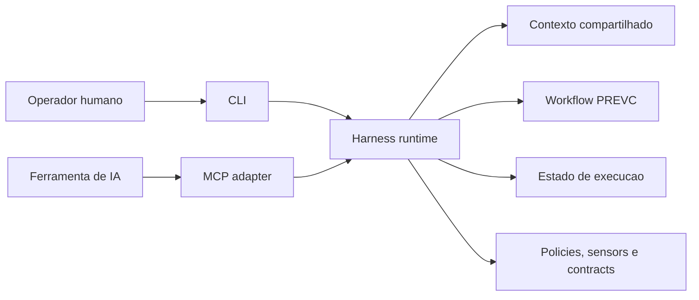
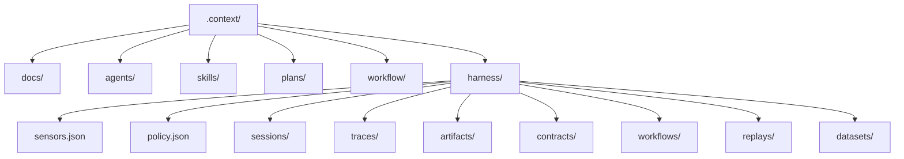
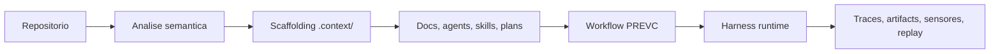
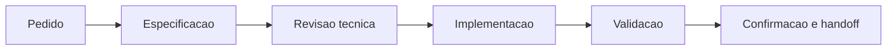
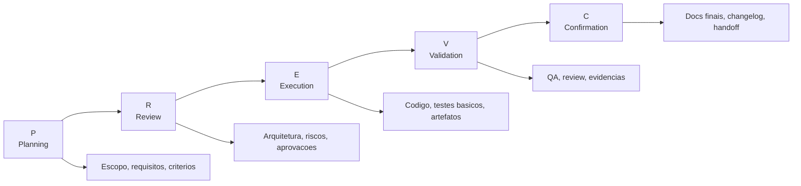
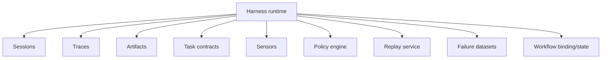
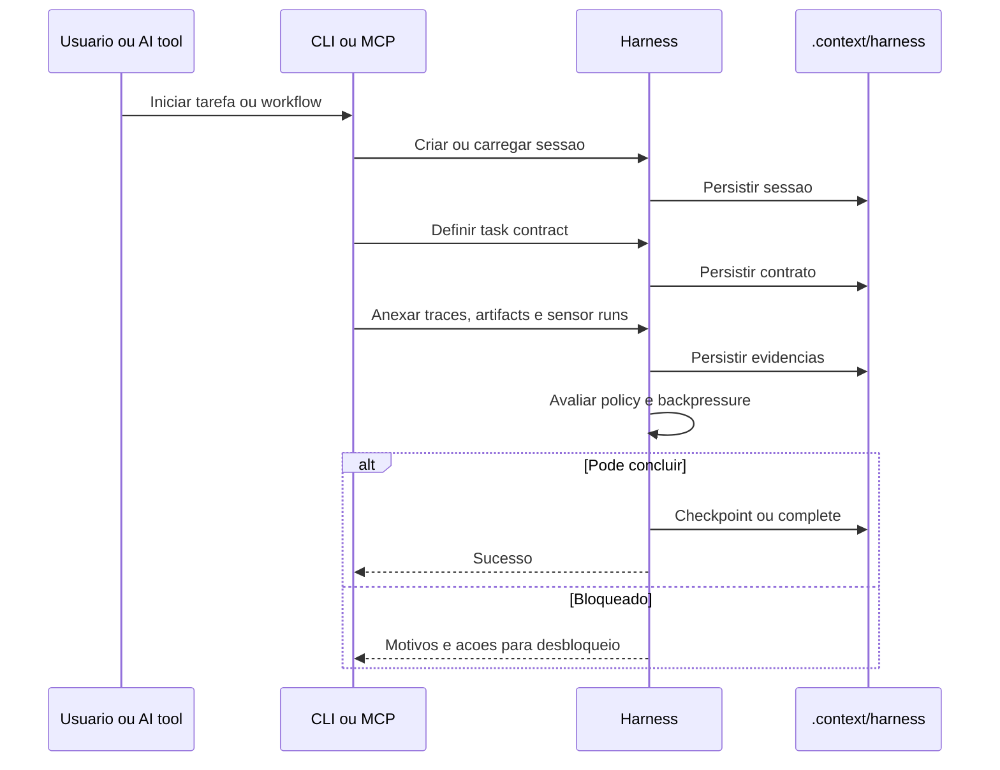
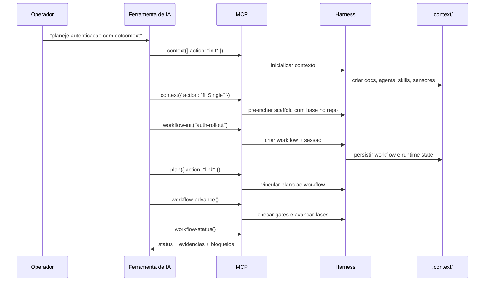

# Guia Educativo: Contexto, Workflow, Harness e CLI no Dotcontext

Este material explica como o dotcontext organiza contexto, workflow e execucao assistida por IA. A ideia central do projeto nao e "dar mais texto para o modelo", e sim criar um sistema operacional de trabalho para agentes.

Use este guia como complemento de:

- `README.md` para visao geral do produto
- `ARCHITECTURE.md` para arquitetura consolidada
- `docs/GUIDE.md` para uso pratico da ferramenta

## 1. Mapa Mental

Em uma frase para cada conceito:


| Conceito    | Papel no sistema                                      |
| ----------- | ----------------------------------------------------- |
| `.context/` | Memoria operacional e conhecimento duravel do projeto |
| `workflow`  | Processo estruturado de trabalho, baseado em PREVC    |
| `harness`   | Runtime que controla e persiste a execucao do agente  |
| `cli`       | Superficie para operadores humanos                    |
| `mcp`       | Superficie para ferramentas de IA                     |


O modelo arquitetural e este:




Leitura correta do diagrama:

- `cli` e `mcp` sao portas de entrada
- `harness` e o nucleo reutilizavel
- o workflow nao substitui o harness; ele roda em cima do harness
- o contexto nao e apenas documentacao; ele tambem alimenta workflow, skills, agentes e operacao

## 2. O Que E o Sistema de Contexto

No dotcontext, "contexto" e um conjunto de artefatos persistentes e operacionais. Nao e apenas um prompt grande.

O diretorio `.context/` concentra esse conhecimento:




### 2.1 Tipos de contexto

O projeto separa contexto em tres classes importantes:


| Classe      | Exemplos                                                                                             | Vai para git?   | Funcao                                         |
| ----------- | ---------------------------------------------------------------------------------------------------- | --------------- | ---------------------------------------------- |
| `versioned` | `.context/docs`, `.context/agents`, `.context/skills`, `harness/sensors.json`, `harness/policy.json` | Sim             | Conhecimento duravel e configuracao do projeto |
| `local`     | `.context/plans`                                                                                     | Nao, por padrao | Artefatos locais de trabalho e planejamento    |
| `runtime`   | `.context/workflow`, `.context/harness/sessions`, `traces`, `artifacts`, `replays`, `datasets`       | Nao             | Estado vivo de execucao                        |


Essa distincao e importante porque evita misturar:

- conhecimento duravel com lixo transiente de execucao
- especificacao com historico de runtime
- configuracao de equipe com estado local do agente

### 2.2 O que entra no contexto

Em termos praticos, o sistema de contexto agrega:

- documentacao do projeto
- playbooks de agentes
- skills reutilizaveis
- planos de implementacao
- configuracao de sensores e policy
- estado de workflow e runtime
- contexto semantico gerado a partir do codebase

## 3. Engenharia de Contexto

Engenharia de contexto nao e "colocar mais informacao no prompt". E desenhar um sistema em que a informacao certa aparece na fase certa, no formato certo, com persistencia e reutilizacao.

No dotcontext, isso aparece em quatro camadas:

1. `scaffolding`: cria a estrutura base de `.context/`
2. `semantic analysis`: gera contexto a partir do codigo real
3. `workflow`: escolhe quando cada contexto deve ser usado
4. `runtime`: registra o que foi feito, com evidencias e restricoes




### 3.1 O que isso resolve

Sem engenharia de contexto, o fluxo costuma ser:

- pedido do usuario
- prompt improvisado
- geracao direta de codigo
- pouco controle sobre por que aquilo foi feito

Com engenharia de contexto, o fluxo vira:

- pedido do usuario
- descoberta do repositorio
- materializacao de contexto duravel
- definicao de plano e criterios
- execucao com rastreabilidade

## 4. Spec-Driven Development

Spec-driven development significa que o codigo e consequencia da especificacao, nao o contrario.

Aqui, "spec" nao significa apenas um documento formal. Pode incluir:

- escopo
- requisitos
- criterios de aceitacao
- decisoes arquiteturais
- riscos e dependencias
- plano por fase
- evidencias de validacao

O README resume isso bem: primeiro entender o que construir, depois validar a abordagem, depois implementar.




### 4.1 Como PREVC implementa isso

O workflow PREVC e a espinha dorsal do spec-driven development no dotcontext:


| Fase | Significado  | Pergunta principal                              |
| ---- | ------------ | ----------------------------------------------- |
| `P`  | Planning     | O que precisa ser feito?                        |
| `R`  | Review       | Esta abordagem faz sentido?                     |
| `E`  | Execution    | Como implementar o que foi aprovado?            |
| `V`  | Validation   | Isso atende a spec e passou nos checks?         |
| `C`  | Confirmation | O que fica documentado, entregue e transferido? |





### 4.2 Por que isso melhora agentes

Sem spec-driven development, o modelo tenta adivinhar intencoes. Com spec-driven development:

- o agente tem uma fronteira clara de escopo
- a revisao acontece antes do custo alto da implementacao
- validacao compara a entrega contra a spec original
- o trabalho fica reproduzivel entre pessoas, ferramentas e sessoes

## 5. Workflow Nao E Harness

Essa distincao merece destaque:


| Elemento   | Funcao                                                             |
| ---------- | ------------------------------------------------------------------ |
| `workflow` | Define as fases, gates e transicoes de trabalho                    |
| `harness`  | Garante estado, evidencia, policy, sensores e controle de execucao |


Em outras palavras:

- workflow responde "em que etapa estamos?"
- harness responde "o que aconteceu, com que evidencias, sob quais regras?"

No projeto atual, o estado canonico do workflow e persistido em `.context/harness/workflows/prevc.json`, enquanto `.context/workflow/` continua sendo a area operacional de workflow.

## 6. Harness Engineering

Harness engineering e o passo seguinte depois de prompt engineering e context engineering.

### 6.1 Diferenca entre as tres ideias


| Abordagem           | Foco                                          | Limite                                      |
| ------------------- | --------------------------------------------- | ------------------------------------------- |
| Prompt engineering  | Melhorar uma interacao                        | Nao controla o ciclo de vida inteiro        |
| Context engineering | Organizar conhecimento e recuperacao          | Ainda nao garante comportamento operacional |
| Harness engineering | Controlar a execucao com runtime e evidencias | Exige arquitetura e persistencia            |


### 6.2 O que o harness faz aqui

O harness do dotcontext centraliza servicos reutilizaveis como:

- sessoes
- traces
- artifacts
- checkpoints
- task contracts
- handoff contracts
- sensors
- backpressure
- policies
- replay
- failure datasets




### 6.3 Ciclo de vida de execucao




### 6.4 Por que isso importa

Sem harness engineering, um agente pode:

- editar codigo sem contexto suficiente
- concluir tarefa sem evidencia
- pular validacao
- perder historico entre sessoes

Com harness engineering, a execucao fica:

- rastreavel
- auditavel
- sujeita a regras
- reutilizavel entre CLI, MCP e futuros adapters

## 7. Papel da CLI

A CLI e a interface do operador humano. Ela nao deveria concentrar regra de dominio reutilizavel.

No repositorio, isso aparece em:

- `src/index.ts`: definicao dos comandos
- `src/cli/index.ts`: boundary da superficie CLI
- `src/services/cli`: servicos especificos de CLI

Responsabilidades principais da CLI hoje:

- iniciar a configuracao MCP e os fluxos operacionais
- expor comandos operacionais e administrativos
- executar sync/import/export
- acompanhar workflow fora da ferramenta de IA

Exemplos:

```bash
npx -y @dotcontext/cli@latest
npx @dotcontext/mcp install
npx -y @dotcontext/cli@latest admin workflow status
npx -y @dotcontext/cli@latest sync --preset cursor
```

Ponto importante: a CLI nao e o centro do produto. Ela e uma superficie de operacao.

## 8. Papel do MCP

O MCP e o adaptador para ferramentas de IA. Ele expoe o runtime atraves de tools.

No codigo, isso aparece em:

- `src/mcp/index.ts`: boundary MCP
- `src/services/mcp/mcpServer.ts`: servidor MCP
- `src/services/mcp/gateway`: handlers das tools

Em vez de despejar toda a logica na camada MCP, o projeto tenta manter o MCP como adaptador fino:

- recebe request
- valida parametros
- chama servicos do harness
- devolve resposta para a ferramenta

Exemplos de tools MCP:

- `context`
- `workflow-init`
- `workflow-status`
- `workflow-advance`
- `workflow-manage`
- `plan`
- `agent`
- `skill`

## 9. Onde Cada Responsabilidade Mora no Codigo

Se voce for evoluir o sistema, este mapa evita acoplamento errado:


| Se voce quer mudar...                       | Preferir                                      |
| ------------------------------------------- | --------------------------------------------- |
| logica reutilizavel de execucao             | `src/services/harness`                        |
| superficie de runtime exportada como pacote | `src/harness/index.ts`                        |
| shape do protocolo MCP e handlers           | `src/services/mcp/gateway`                    |
| boundary MCP                                | `src/mcp/index.ts`                            |
| comandos e UX de terminal                   | `src/index.ts`, `src/cli`, `src/services/cli` |
| modelo PREVC, gates e orquestracao          | `src/workflow` e `src/services/workflow`      |


Esse alinhamento preserva a intencao arquitetural do repositorio:

```text
cli -> harness <- mcp
```

## 10. Fluxo Completo de Exemplo

Imagine a entrega de uma feature de autenticacao.




### 10.1 O que acontece de verdade nesse fluxo

1. O contexto e materializado em disco, nao apenas na conversa.
2. O workflow ganha fases e gates explicitos.
3. O harness cria sessao, traces e binding entre workflow e runtime.
4. A execucao pode ser bloqueada se policy, sensores ou evidencias estiverem incompletos.
5. O historico fica reutilizavel para replay, dataset e auditoria.

## 11. Resumo Executivo

Se voce precisar explicar o dotcontext rapidamente para outra pessoa, uma boa versao e esta:

- `.context/` e a memoria operacional do projeto
- PREVC e o processo de desenvolvimento guiado por especificacao
- o harness e o runtime que controla a execucao do agente
- a CLI serve o operador humano
- o MCP serve a ferramenta de IA
- a arquitetura separa superficie, runtime e protocolo para manter o sistema evolutivo

Em termos de maturidade:

- prompt engineering melhora respostas isoladas
- context engineering melhora continuidade e relevancia
- harness engineering melhora controle, rastreabilidade e confiabilidade operacional
